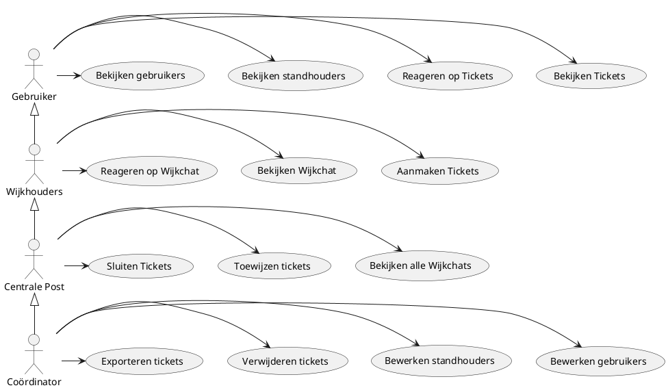
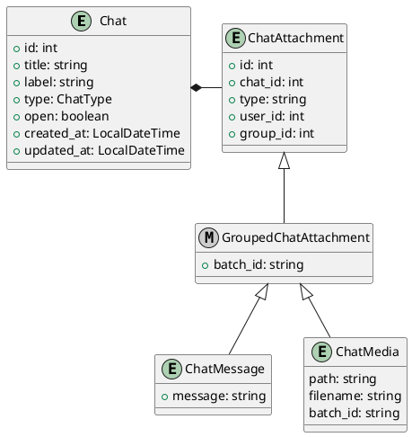

# Vana LogistiekApp

De Vana LogistiekApp ("Penis Logistiekapp") is een ticketingsysteem voor logistiekers op Castlefest. Het primaire doel
van de applicatie is assisteren met de communicatie tussen de vrijwilligers in het veld, in de CP en om een naslagwerk
te zijn voor organisatie en coördinatie.

## Rollen

We erkennen 4 soorten gebruikers:

- Gebruikers
- Wijkhouders
- Centrale Post
- Coördinator

Het use-case diagram is als volgt:

## Domains

Om de applicatie beheersbaar te houden, is besloten dat eigenlijk alle communicatievormen
chats zijn. Alle chats worden beheerd in het Chat-domein, waarmee andere domeinen praten.

Verdere domeinen zijn vaak gekoppeld aan het Chat-domein. Deze andere domeinen zijn:

- **Tickets**, die informatie over de afhandeling van een ticket vasthouden (wie gaat het over, wie
heeft het gemeld, wie heeft er een actie, is het opgelost?)
- **Wijk** die informatie over wijken bevatten: welke standhouders staan er in, welke gebruikersgroepen werken in deze groepen en welke chat hoort er bij?
- **Standhouders**, met één service die de standhouders kan aangeven aan de hand van ID of nummer.

### Shared Domain

Het shared domein bevat models en services voor globaal-gekoppelde items. Hierbij gaat het om de
volgende modellen:

- Gebruikers als `User`
- Gebruikersgroepen als `Group`

### Chat-domain

Het _Chat_ domein bevat chats, berichten en acties in chat ("Attachments"), en deelnemers (User of Group). Een chat
heeft in beginsel een relatie, en chats zijn enkel op ID op te vragen.

